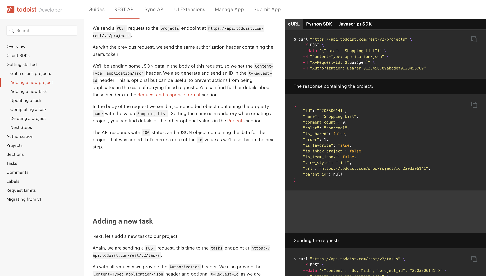
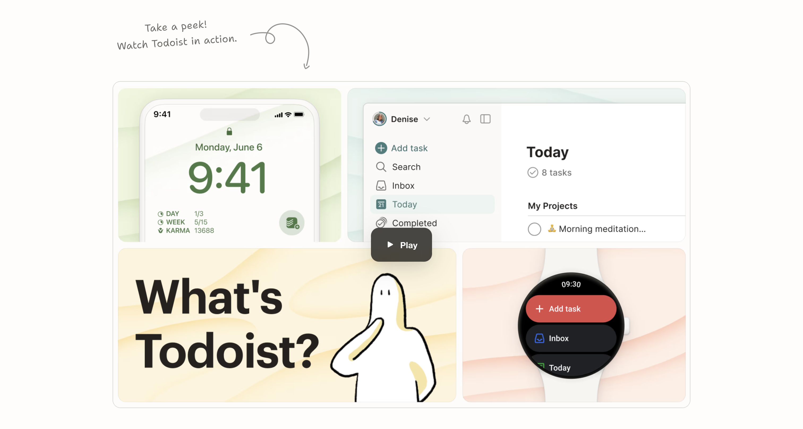
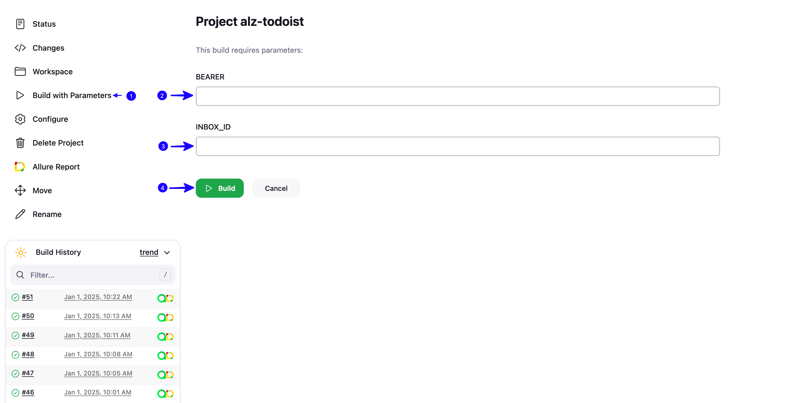
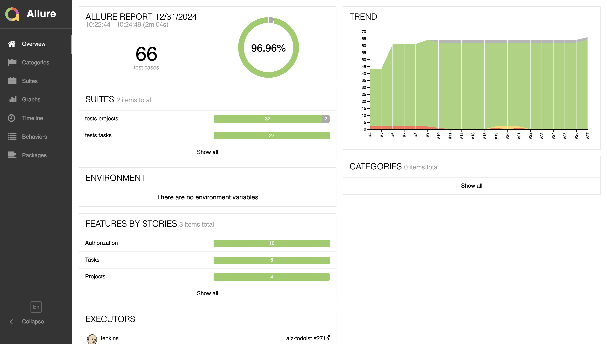
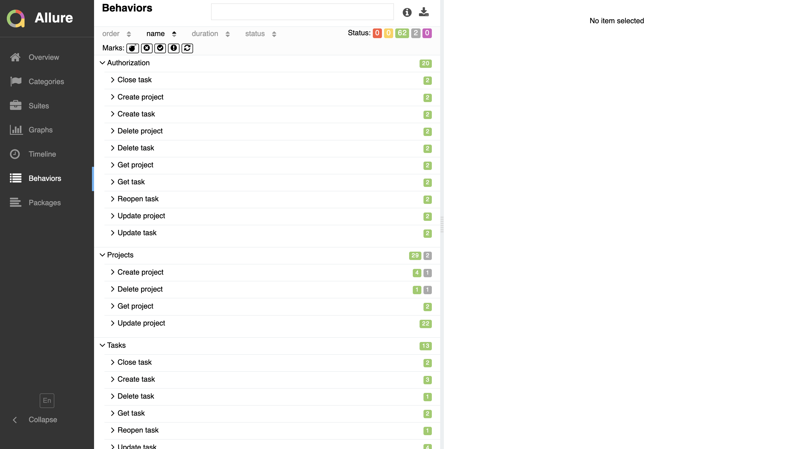
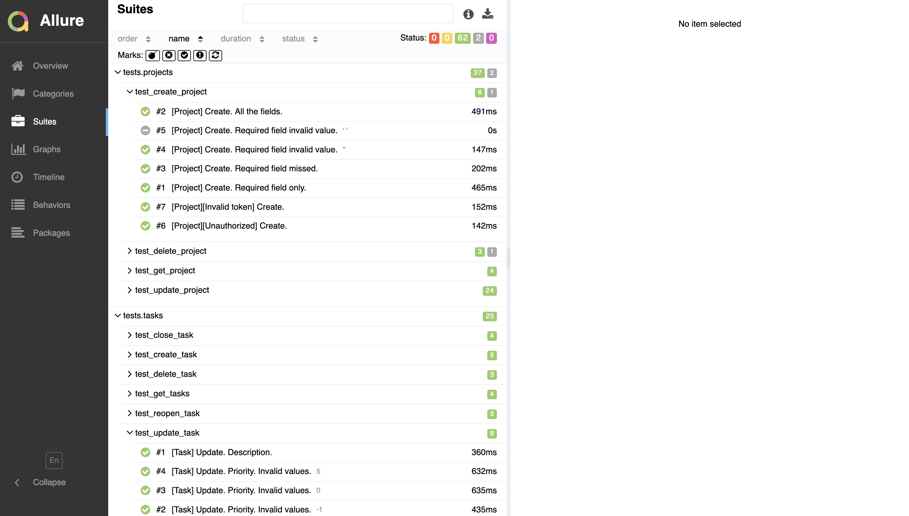
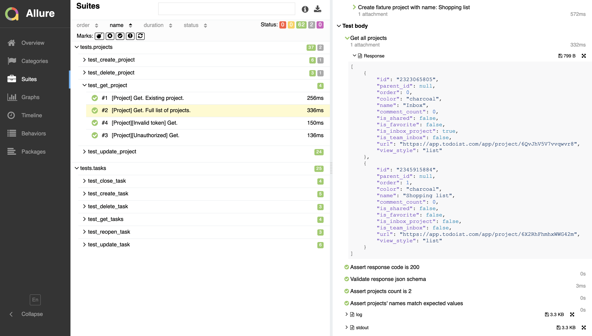
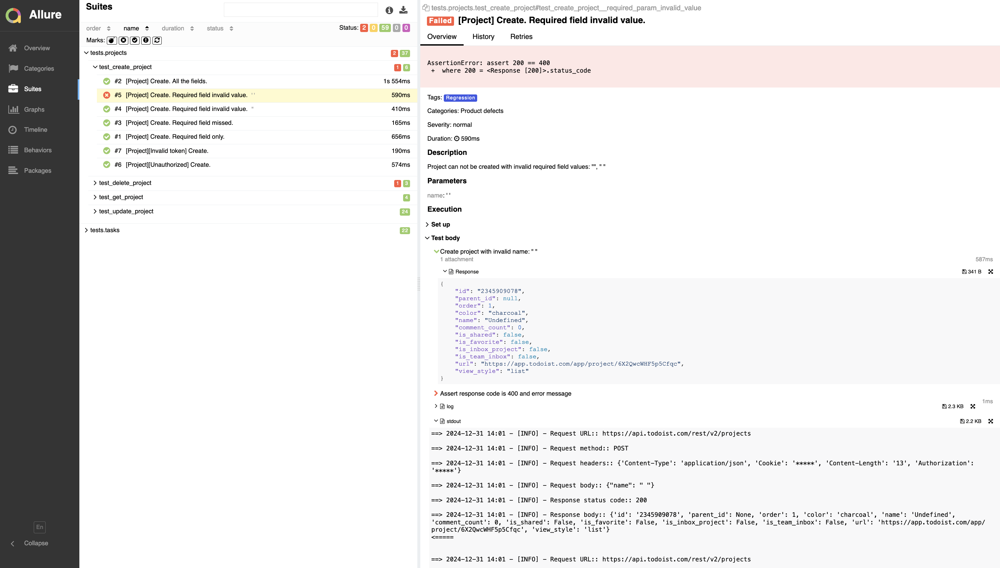
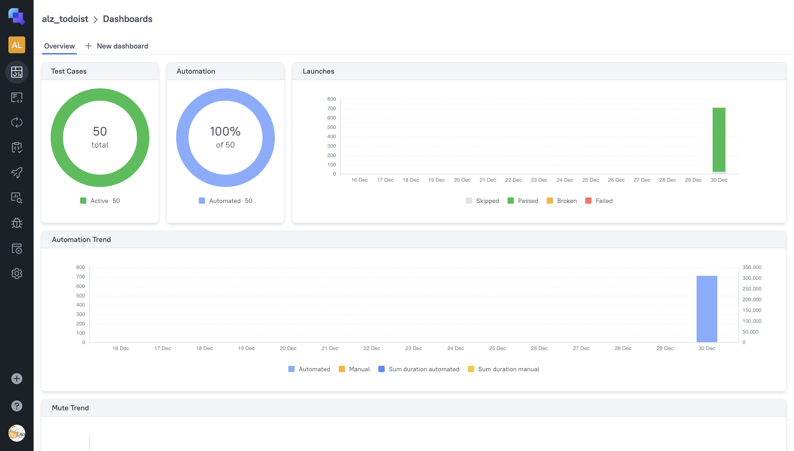
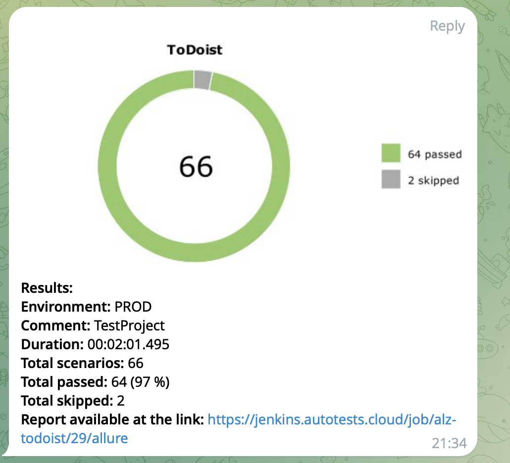

# <p align="center"> API automation project <a href="https://developer.todoist.com/rest/v2/#overview"> Todoist REST API </a></p>

<p align="center">
    
</p>

Todoist itself is an app that helps organize and manage projects and tasks.
<p align="center">
    
</p>

## Contents

- [Technology Stack and Instruments](#technology-stack-and-instruments)
- [Covered Functionality](#covered-functionality)
- [Run Tests in Jenkins](#run-tests-in-jenkins)
- [Allure Report](#allure-report)
- [Allure TestOps](#allure-testops-integration)
- [Messenger Notifications](#messenger-notifications)

## Technology Stack and Instruments

<p  align="center">
    <code></code>
    <code></code>
    <code></code>
    <code></code>
    <code></code>
    <code></code>
    <code></code>
    <code></code>
    <code></code>
    <code></code>
</p>

## Covered Functionality

#### API tests cover `project` and `task` endpoints.

##### What is checked?

➜ Response status code  
➜ Response JSON schema  
➜ Response fields' values  
➜ Error message  
➜ Unauthorized requests

* ✅ Project
    * ☑️ Create project
        * ✓ with required parameters only
        * ✓ with all the parameters
        * ✓ without required fields
        * ✓ with invalid required field values
    * ☑️ Get project
        * ✓ existing project
        * ✓ full list of projects
    * ☑️ Update project
        * ✓ existing project updated with valid field values
        * ✓ update with empty request body
        * ✓ update project color from available set of colors
        * ✓ update project color with unavailable color
    * ☑️ Delete project
        * ✓ existing project
        * ✓ not existing project
* ✅ Task
    * ☑️ Create task
        * ✓ with required parameters only
        * ✓ with several parameters
        * ✓ without required fields
    * ☑️ Get task
        * ✓ existing task
        * ✓ full list of tasks
    * ☑️ Update task
        * ✓ update field with valid value
        * ✓ update field with invalid value
    * ☑️ Close task
        * ✓ existing task
        * ✓ not existing task
    * ☑️ Reopen task
        * ✓ reopen existing previously closed task
        * ✓ reopen opened task
        * ✓ reopen task which has closed ancestor
    * ☑️ Delete task
        * ✓ delete existing task
* ✅ Unauthorized requests
    * ☑️ Requests without authorization token
    * ☑️ Requests with invalid authorization token

## Run tests in Jenkins

[Link to Jenkins job](https://jenkins.autotests.cloud/job/alz-todoist/)

Test running requires **Bearer Token** and **Inbox ID**.  
- *Bearer Token* is a token in one's Todoist space. To obtain it, it needs to be registered in
   the [app](#https://todoist.com).  
   From developer docs:

> You can find your token from the Todoist Web app, at `Todoist Settings -> Integrations -> API token`. This token
> remains valid until a new one is generated.
>

- *Inbox ID* is the `id` of one's "Inbox" project within the app. You may find it in response to
`https://api.todoist.com/rest/v2/projects` request, for instance.

**To run tests**:
1. Click on `Build with Parametes`
2. Paste your Bearer token into `BEARER` field
3. Paste your Inbox ID into `INBOX_ID` field
4. Click on `Build`
5. After build is finished, links to Allure Report and Allure TestOps will be shown next to the job

> > ⚠️ Only the digits part needs to be placed in `INBOX_ID` field, without 'Bearer' word.
> 

<p align="center">

</p> 

## Run tests locally

Local run requires [Python](https://www.python.org/downloads/release/python-3126/)
and [Poetry](https://python-poetry.org/docs/#installation) installed.

1. Download the project and `cd` to its directory
2. In project root create virtual environment and install dependencies:

```bash
python3 -m venv .venv
source .venv/bin/activate
poetry install --no-root
```

3. In the project root create `.env` file and put `token` and `inbox_id` into it as it's shown in `.env_example`.  
   

> > ⚠️ Only the digits part needs to be placed in `.env`, without 'Bearer' word.
>

4. Run tests

```bash
pytest
```

When run is finished, `allure-results` directory is generated in project root. If Allure Report
is [installed](https://allurereport.org/docs/install/), a report can be built locally:

```bash
allure serve allure-results
```

## Allure Report

Allure Report represents a convenient and easy to use interface to analyse test results.
It includes:

- Summary

<p align="center">
    
</p> 

- Information about tests grouped in epics or suits

<p align="center">
    
</p>
<p align="center">
    
</p>

- Detailed steps and attachments to each test (logs with requests and responses)

<p align="center">
    
</p>  

- In case of test failure, the problem root cause can be fast identified

<p align="center">
    
</p> 

## Allure TestOps Integration

### [Dashboard](https://allure.autotests.cloud/project/4544/dashboards)

<p align="center">
    
</p>

Allure TestOps is integrated with Jenkins, and test results are shown in the dashboard. Automated tests can also be run
from Allure TestOps directly.

---

## Messenger Notifications

After Jenkins build is finished, a report with the results is sent to a messenger.
<p align="center">
    
</p>
